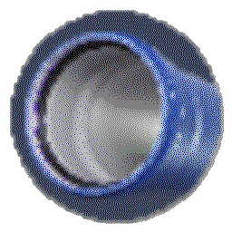

Putki
=====



Putki - Generic data system with C++ and C# support, with Mono/GTK-based editor too.

Types
-----

You define your own data structures and store your input data in JSON, then get them packaged in binary for very efficient lodaing. Here is one example:

```
Globalsettings
{
	string windowtitle
	u32 window_width
	u32 window_height
	ptr Texture icon
	ptr ShaderProgram shader_solid
	ptr ShaderProgram shader_texture
}
```

The compiler then compiles this into automatically generated (c++) code for the following:

- Parsing the structure from JSON files
- Writing the structure into binary format for different machine configuratinos
- Loading the structure from the same binary format
- Code for traversing the structure (following pointers)

Builder
-------

When using this system you will typically arrange your data like this

```
data/obj/<JSON files here>
data/res/<Any other resources>
```

Then you run the data builder on this, where you specify what assets you want, and what the resulting packages will be. 

```
putki::package::data *pkg = putki::package::create(out);
putki::package::add(pkg, "ui/mainmenu/screen", true);
putki::build::commit_package(pkg, pconf, "mainmenu.pkg");
```

This then grabs ui/mainmenu/screen(.json), pulls in all other references objects and writes them into a binary package.

All this happens during the build step (where you can also do any processing you want to transform the data, including adding new output
objects etc).

Runtime
-------

When your application wants to load the data, it loads in the putki runtime library, which is quite tiny and efficient, but can load these packages straight into memory.
The process for loading is to load the file (minus header) into memory, resolve pointers and then everything is ready to go.

```
// package load
putki::pkgmgr::loaded_package *pkg = putki::pkgloader::from_file("mainmenu.pkg");

// grab pointer to the main menu (that was json object)
outki::ui_screen *menu = putki::pkgmgr::resolve(pkg, "ui/mainmenu/screen");
```
In the runtime, all the strings are no longer std::strings as in the build step, and the arrays are no std::vectors<>.

From the definition

```
Example
{
   string txt
   byte[] data
}
```

would then be generated

```
struct Example
{
   const char *txt
   unsigned char *data;
   unsigned int data_size
}
```

All those data bytes and the strings are pointers into the loaded package file and need no dynamic allocation. When loading a packag it will include all the data already.

Patches
-------

The system also supports making incremental builds and writing patch packages, that reference already existing packages but add anything that was modified and added. 

Editor and live editing
-----------------------

Putki comes with a C#/Mono based editor which lets you edit your assets. It also supports live updates, so that you can get instant feedback in your application
when you make changes in the editor (although your application needs to be aware of what goes on).

Of course, if you have build steps on your objects, these are performed onto the edited assets. So you can sit in the editor and tweak build step parameters and
enjoy direct feedback in your application.

It is also possible to write custom editor plugins for your own data types, should the built-in property editor not be enough. (For instance for level maps).

This functionality is enabled or disabled with the preprocessor, so it can be stripped out from your final builds.

```
if (LIVE_UPDATE(&object_pointer))
{
	// object has been updated! pointer has now changed and
	// we might want to do stuff here to handle getting new
	// data.
}

if (LIVE_UPDATE_ISNULL(object_pointer->sub_thing))
{
	// here we check for null conditions that we are only
	// ever interested in handling while doing live updates
	return;
}
```

Building without live updates enabled turns those expressions into permanent false.


C# support
----------

Putki also comes with code generation for C# and a small runtime library, so you can load
the binary packages into your C# applications as well.
